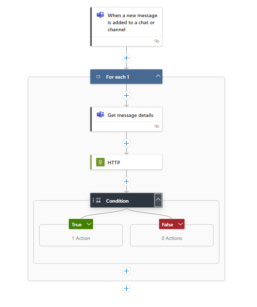

# CST8917-Lab3: Implementing a Teams Chat Content Moderation Service
## Microsoft Teams + Logic App + Azure Cognitive Services: Sentiment Detection Lab

## 📌 Objective
Trigger a Logic App from a Microsoft Teams message, analyze its sentiment using Azure Cognitive Services, and send an email if the message is **negative**.

---

## ✅ Prerequisites

- Azure subscription with Logic Apps and Cognitive Services permissions
- Outlook or Office 365 email account
- Access to Microsoft Teams (with message webhook capability)
- Postman or Power Automate Desktop (optional testing tools)
- Azure Cognitive Services Resource (Language API)
- Logic App Designer in Azure Portal

---

## 🛠️ Steps

### 1. **Create Azure Logic App**
1. Go to the [Azure Portal](https://portal.azure.com).
2. Click **Create a resource** → search for **Logic App (Consumption)**.
3. Fill in:
   - Resource Group: `logicapp-rg`
   - Logic App name: `teams-sentiment-app`
   - Region: `Canada Central` (or your preferred)
4. Click **Review + Create** → **Create**.

---

### 2. **Trigger Logic App via HTTP Request**
1. In Logic App Designer, select **"When an HTTP request is received"**.
2. Add sample JSON schema for Teams message:
   ```json
   {
     "type": "object",
     "properties": {
       "content": {
         "type": "string"
       }
     }
   }

### 3. Get Message Details (Teams)
Added "Get Message Details" step to get the text message that posted in the team as the before step just sending messageid and chatid as output from the trigger
  ```bash
    https://graph.microsoft.com/v1.0/chats/<chatId>/messages/<messageId>
```
### 4. Send Message to Cognitive Services
1. Add a new step: HTTP
2. Set it to "POST"
URL: Your Cognitive Services Endpoint(https://<your-region>.api.cognitive.microsoft.com/text/analytics/v3.2/sentiment)
3. Headers:
   ```json
   {
    "Ocp-Apim-Subscription-Key": "<your-api-key>",
    "Content-Type": "application/json"
    }
4. Body (dynamic content from the incoming request):
   ```json
   {
      "documents": [
      {
        "language": "en",
        "id": "1",
        "text": "@{triggerBody()?['content']}"
      }
      ]
    }

### 5. Condition control block:
1. In the Expression, paste:
   body('HTTP')['documents'][0]['sentiment']
2. Operator: "is equal to"
3. Right-hand value: "negative"

### 6. Send an email.
Inside the If true branch of the Condition:Add Send an email (V2) action.



### Troubleshooting & Issues
Problem 1: Invalid Expression
Error: "The expression is invalid."
Fix: Ensure correct case and accurate step name in expressions:
body('HTTP')?['documents'][0]?['sentiment'].

🧾 Output Sample (from Sentiment API)
  ```json
    {
    "documents": [
      {
        "id": "1",
        "sentiment": "negative",
        "confidenceScores": {
              "positive": 0,
              "neutral": 0.27,
              "negative": 0.72
              },
          "sentences": [
            {
               "sentiment": "negative",
                "confidenceScores": {
                "positive": 0,
                "neutral": 0.27,
                "negative": 0.72
                },
                "text": "shit"
              }
            ]
          }
        ]
      }
```

### Youtube Demo Link:
[Watch the 5-minute demo on YouTube](https://www.youtube.com/watch?v=s6p_Plc0KFc)

---


